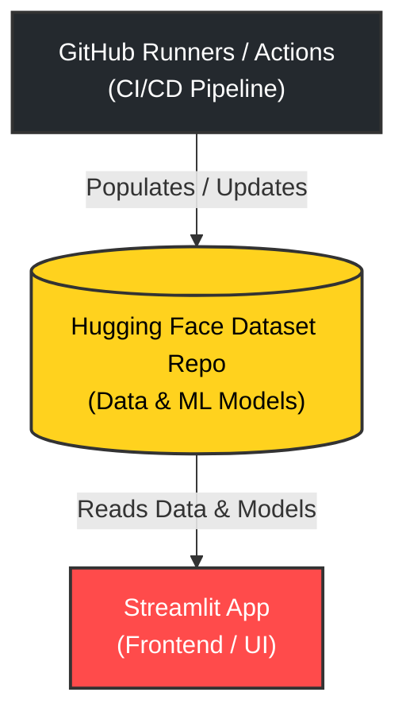
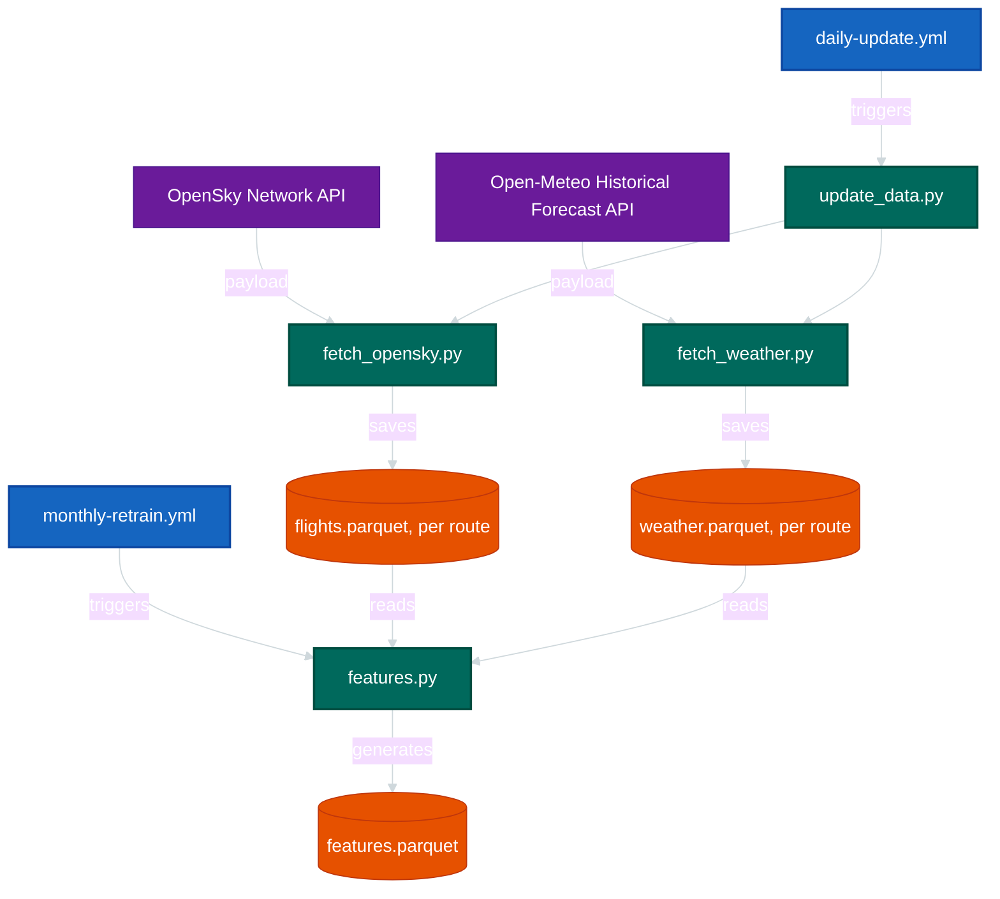
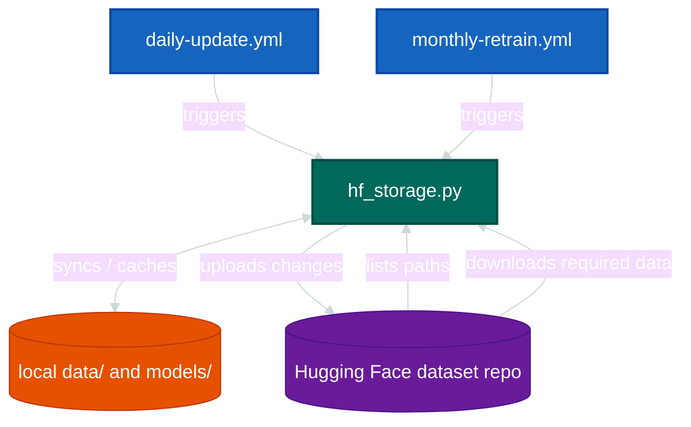
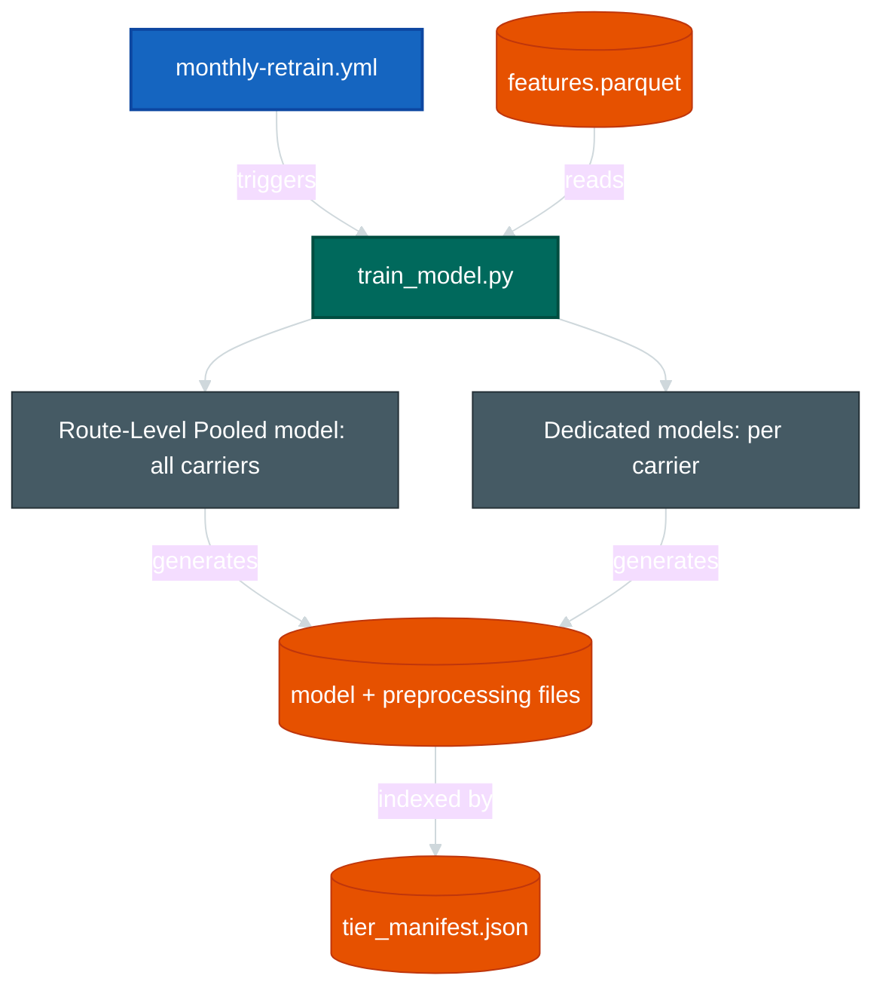
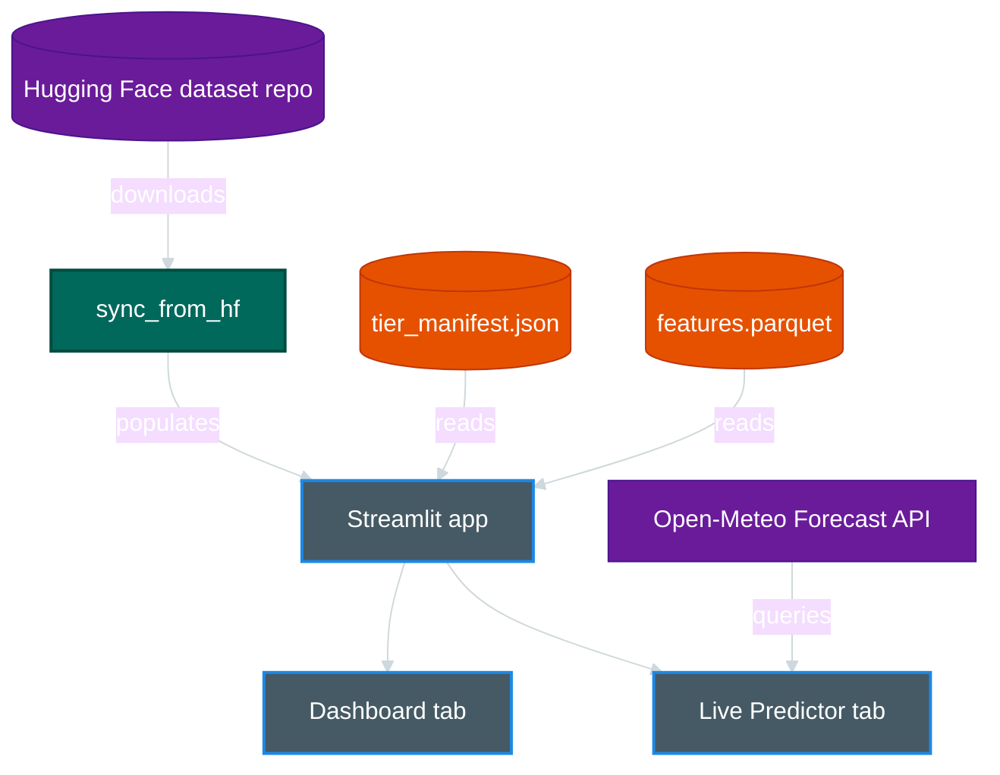

# Architecture

## Overview

A small MLOps pipeline that fetches flight and weather data, builds a feature matrix, trains route-level pooled quantile regression models and (where sufficient data are available) carrier-specific models within each route, and serves the resulting predictions through a Streamlit dashboard.

Data and trained models are persisted either to a Hugging Face dataset repository or to the local filesystem. The latter is the local execution mode described in `README.md`, and can be used when running the system directly on a machine or through Docker.

Pipeline operations are orchestrated through GitHub Actions in the deployed/automated setup, or can be executed manually from a local machine as described in `README.md`.

The system is organized into four main subsystems:

1. **Ingestion / ETL**: retrieves and transforms flight and weather data and builds the model-ready feature data.
2. **Hugging Face storage**: provides remote persistence and synchronization for datasets and trained models when the Hugging Face storage mode is enabled.
3. **ML training**: trains and evaluates the quantile regression models from the prepared feature data.
4. **Streamlit application**: loads the available data and models and provides the dashboard and live prediction interface.

The architecture diagram shows both **data flows and system interactions**. Arrows therefore indicate the direction of the relevant data transfer or call/dependency between components; they do not necessarily represent a pipeline data flow alone.

### General diagram for the currently deployed app on Streamlit Community Cloud: 


# Detailed Breakdown

## 1. Data Ingestion & ETL


**Triggered** by `daily-update.yml`:
-  **Data Fetching:** `update_data.py` imports and uses functions from `fetch_opensky.py`and `fetch_weather.py` for every configured route. Each fetch operation resumes from a route's last stored date instead of refetching everything. The already fetched data are persisted either in the Hugging Face Dataset repo or in the local file system.

**Triggererd** by `monthly-retrain.yml`:
- **Features Creation:** `features.py` merges the accumulated `flights.parquet` +
  `weather.parquet` across all routes into the single `features.parquet` which can be used for training ML models.

## 2. Hugging Face Storage



When using the Hugging Face Dataset repo: 

**Triggered by `daily-update.yml`:**
* **Check for updates:** The `hf_storage.py` script lists remote file paths to check the dates in the filenames. No actual file data is downloaded during this step.
* **Fetch and upload:** If the data is missing or out of date, `update_data.py` fetches the new data from the APIs, saves it temporarily (locally or on the GitHub runner), and uses `hf_storage.py` to upload it to the Hugging Face repository.

**Triggered by `monthly-retrain.yml`:**
* **Download historical data:** To update `features.parquet` and retrain the ML models, `hf_storage.py` downloads the historical data to the temporary local storage or GitHub runner.
* **Save updated artifacts:** After feature extraction and model retraining are complete, the newly generated features and model files are uploaded back to the Hugging Face repository.

*Note: The local `data/` and `models/` folders are ignored by git; In the deployed configuration, Hugging Face provides authoritative persistent storage; local files are used as temporary execution storage or for local development.*


## 3. Model Training Pipeline




**Triggered by `monthly-retrain.yml`:**
* **Conditional carrier training:** The route-level pooled model always trains. However, a carrier only gets a dedicated model if its total flight count meets the minimum threshold defined in `config.MIN_ROWS_FOR_MODEL_FEASIBILITY`.
* **XGBoost Quantile model architecture:** Each valid tier trains three separate models, one for each quantile: P50, P90, and P95
* **Manifest generation:** `tier_manifest.json` is written last. It serves as the project's lightweight model-selection and artifact manifest, recording which model tiers were successfully trained, their validation and holdout metrics, selected configurations, and the locations of their serving artifacts. The application uses the production entries in this manifest to identify the model and preprocessing files required for downstream prediction.

## 4. Streamlit App 


<br></br>
* **Dual data sourcing:** Setting `DATA_SOURCE=hf` (used in Streamlit Cloud) triggers a sync operation via `hf_storage.py` once per process spin-up before serving users. Setting `DATA_SOURCE=local` (used in Docker or local dev) completely skips this step and reads the bind-mounted `data/` and `models/` folders directly.
* **Isolated dashboard tab:** The Dashboard tab requires only `tier_manifest.json` and `features.parquet` to display historical analytics. It requires zero live network calls.
* **Cached live predictions:** The Live Predictor tab is the only component in the application that talks to the Open-Meteo Forecast API directly. These external forecast queries are cached once per calendar day to save on API overhead.


## Components

| Component | File(s) | Responsibility |
|---|---|---|
| Flight ingestion | `src/fetch_opensky.py` | Pull arrival history from OpenSky, cache per-day chunks, dedup/merge into `flights.parquet`, for each route. |
| Weather ingestion | `src/fetch_weather.py` | Pull historical weather (training) and live forecast (serving) from Open-Meteo, same per-day chunk caching pattern. Saves collected results in `weather.parquet` for each route. |
| Incremental update | `src/update_data.py` | Daily entry point: resumes from the last stored date per route, with failure backoff.  |
| Feature engineering | `src/features.py` | Merge flights + weather into `features.parquet`; defines the canonical feature schema (`WEATHER_FEATURES`, `dep_*`/`arr_*` columns) |
| Modeling | `src/train_model.py` | Trains route-level pooled + per-carrier XGBoost quantile models, walk-forward backtests, writes `tier_manifest.json`. |
| Storage sync | `src/hf_storage.py` | Upload/download to the Hugging Face dataset repo; remote freshness check |
| Airline metadata | `src/airlines.py` | Callsign and carrier code to human-readable labels extraction. |
| App | `app/streamlit_app.py` | Dashboard + Live Predictor UI, reads `tier_manifest.json`/`features.parquet`, replays the trained preprocessing for inference |
| Config | `config.py` | Single source of truth for routes, airports, paths, thresholds |

## Data and Model Artifact Structure

```
data/
├── manifest.json
├── processed/
│   ├── <ORIGIN>_<DEST>/
│   │   ├── flights.parquet
│   │   └── weather.parquet
│   ├── features.parquet
│   ├── pipeline_stats.json
│   └── update_checkpoint.json
└── raw/
    ├── <ORIGIN>_<DEST>/
    │   └── arrivals/
    │       └── arrivals_<DEST>_<start>_<end>.parquet
    ├── opensky_credit_log.csv
    └── weather_hist_chunks/
        └── <AIRPORT>/
            └── <AIRPORT>_<start>_<end>.parquet

models/
└── <ORIGIN>_<DEST>/
    ├── all_carriers/
    │   ├── quantile_<q>.json
    │   └── preprocessing_<q>.pkl
    ├── by_carrier/
    │   └── <CODE>/
    │       ├── quantile_<q>.json
    │       └── preprocessing_<q>.pkl
    ├── backtest.json
    └── tier_manifest.json
```

## `tier_manifest.json` shape (per route):

Each route has a tier_manifest.json that acts as the metadata and model-selection manifest for the trained models. It records the route-level training/validation policies and dataset information, together with the available model tiers.

There are two model tiers:

- all_carriers: one pooled model for the route, with airline available as a feature.
- by_carrier: separate models for individual carriers that satisfy the training-data and validation requirements.

For each tier, the manifest records whether the tier was successfully trained, the dataset sizes and validation configuration, and a quantiles object containing the separately trained P50, P90 and P95 models. 

Each quantile entry contains the selected hyperparameters, the features used, final chronological holdout metrics, walk-forward backtest results, and the serving artifacts. The production section identifies the serialized model and preprocessing files and stores the route median and feature importance information.

A simplified representation of the structure is:

```json
{
  "route": "...",
  "updated_at_utc": "...",
  "selection_policy": "...",
  "production_policy": "...",
  "validation_policy": { 
    "...": "..."
  },
  "final_holdout_policy": {
    "...": "..."
  },
  "walkforward_backtest_policy": {
    "...": "..."
  },
  "tuning_policy": {
    "...": "..."
  },

  "dataset": {
    "route": "...",
    "total_rows": 0,
    "train_rows": 0,
    "holdout_rows": 0,
    "model_features": ["..."],
    "outlier_rule": {
      "...": "..."
    }
  },

  "all_carriers": {
    "route": "...",
    "tier": "all_carriers",
    "pooled": true,
    "trained": true,
    "n_rows": 0,
    "quantiles": {
      "0.5": {
        "hyperparameters": {
          "...": "..."
        },
        "model_features": ["..."],
        "final_holdout_metrics": {
          "...": "..."
        },
        "walkforward_backtest": {
          "...": "..."
        },
        "production": {
          "model_path": "...",
          "preprocessing_path": "...",
          "route_median": 0.0,
          "feature_importance": {
            "...": 0.0
          }
        }
      },
      "0.9": {
        "...": "same shape..."
      },
      "0.95": {
        "...": "same shape..."
      }
    }
  },

  "by_carrier": {
    "carriers": {
      "<CODE>": {
        "route": "...",
        "tier": "<CODE>",
        "pooled": false,
        "trained": true,
        "n_rows": 0,
        "quantiles": {
          "0.5": {
            "...": "same shape..."
          },
          "0.9": {
            "...": "same shape..."
          },
          "0.95": {
            "...": "same shape..."
          }
        }
      }
    }
  }
}
```

Each `preprocessing_<q>.pkl` stores everything needed to replay inference
without retraining: `feature_columns` (exact order), `imputer_statistics`
(per-column medians for missing-value fill), and for route-level pooled models,
`airline_encoding` (target-encoding map + fallback). The fitted sklearn
imputer object itself is never persisted — only its statistics — so
inference reimplements the fill step from those stored values rather than
depending on a pickled sklearn object.

## ML Component Architecture

The model is designed to serve as a **quantile-based decision support model** and not as a point predictor.

The operational question posed is: 

- "How much buffer time should ground operations (or relevant stakeholders) allocate for a flight, given historical data, forecasted weather, and the required protection against delays?""

The **target variable** is **flight duration anomaly**, which for each flight is its flight duration minus the median over a period of time ("historical median")

Quantile regression permits the estimation of different points of the conditional distribution of the flight-duration anomaly: 

- **P50 (Median):** Estimates the conditional median of the flight-duration anomaly.
- **P90 (90th Percentile):** Estimates the conditional 90th percentile of the target distribution. When the model is well calibrated, approximately 90% of observations should fall at or below the predicted value.
- **P95 (95th Percentile):** Estimates the conditional 95th percentile of the target distribution. When the model is well calibrated, approximately 95% of observations should fall at or below the predicted value. It provides a high-protection threshold for risk-averse scenarios.

*<u>Note:</u> This is conceptually analogous to the logic of a Newsvendor problem: the decision maker must balance the cost of under-provisioning against the cost of over-provisioning. Here, the scarce resource is time rather than inventory. A lower quantile corresponds to a smaller buffer and greater tolerance for late arrivals, while a higher quantile allocates more time to reduce the risk of shortage. While the implementation estimates predefined quantiles rather than explicitly optimizing an operational cost function, it shares a similar underlying trade-off.*


**Each successfully trained model tier consists of three independently trained XGBoost quantile regressors, one for each target quantile: P50, P90, and P95.**

**The application interprets these quantiles as operational "buffer" estimates.**

**Tiered Models:** Models are trained as dedicated airline models where data allows, or as route-level models pooling all airlines together.

**Inference Fallback:** The deployed Streamlit app uses the carrier-specific model if available for that route; otherwise, it falls back to the route-level pooled model.


### Model Choice 

The model chosen was XGBoost because:
- It's suitable for tabular, heterogeneous features. 
  - Gradient-boosted decision trees are a well-established choice for this type of structured data and can capture nonlinear relationships and feature interactions without requiring extensive manual feature engineering.
- It provides native support for quantile regression through the `reg:quantileerror` objective setting (in Python).
- It is a mature and widely used gradient-boosting framework with efficient training and prediction.
- It does not require feature scaling and can accommodate features that have limited or no variation in a particular training subset.
   - This is useful for a pipeline where the feature schema is kept fixed across routes and carrier-specific subsets. A feature may be effectively constant during one training period without requiring the feature to be removed from the schema; if it becomes variable in later data, the same feature can be used without changing the model input schema.
- It allows extensibility for explainability since XGBoost models can be integrated with SHAP for feature-attribution analysis.
- It was empirically compared to another efficient gradient boosting model: LightGBM. While both performed similarly on the chosen route overall, XGBoost showed more consistent validation metrics across the individual temporal validation folds used in the corresponding experiment (see the Jupyter Notebooks in `\notebooks`). 
  - *<u>Note:</u>The LightGBM comparison was performed on the currently available route only, so it is not treated as evidence that XGBoost is universally superior. Rather, it provided empirical support for selecting XGBoost for the current POC. Performance should be monitored as additional routes and carriers are introduced, and the model framework can be revisited if another algorithm demonstrates consistently better predictive performance, calibration, or stability on the expanded dataset.*


### Metrics 

- **Pinball loss:** The primary metric for quantile regression. It penalizes prediction errors asymmetrically according to the target quantile. 
  - e.g: A P90 model is penalized more strongly when it underestimates the actual outcome than when it overestimates it. 
  - Lower pinball loss indicates better quantile predictions.
- **Quantile coverage:** The proportion of observed outcomes that fall at or below the predicted quantile. 
  - e.g: a well-calibrated P90 model should have approximately 90% of observed outcomes at or below its prediction. 
  - Coverage indicates whether the predicted quantile provides the intended level of protection.
- **MAE (Mean Absolute Error):** The average absolute difference between the predicted value and the observed value. 
  - It measures the typical magnitude of prediction errors without allowing positive and negative errors to cancel each other.
- **MedAE (Median Absolute Error):** The median absolute prediction error. Compared with MAE.
  - It is less affected by a small number of unusually large errors. This makes it a more robust typical error descriptor.
- **RMSE (Root Mean Squared Error):** The square root of the mean squared prediction error. 
  - Because larger errors are penalized more heavily, RMSE is useful for identifying models that occasionally produce large prediction errors.
- **Mean error:** The average signed difference between predicted and observed values. 
  - It indicates systematic bias: positive or negative values show whether the model tends to overpredict or underpredict respectively.


### Evaluation strategies

- **Chronological final holdout:** The chronologically ordered dataset is split into an initial 80% training period and a final 20% holdout period. 
The holdout is excluded from hyperparameter tuning and model selection, and is evaluated once per model and quantile to estimate out-of-sample performance on later observations.

- **Chronological cross-validation:** The training period is evaluated using
  expanding-window `TimeSeriesSplit` folds. The number of expanding-window folds are determined from the number of complete calendar years available in each model population, subject to a **minimum** of **2 complete years**. Dedicated carrier models determine their fold count independently.

  
- **Walk-forward backtesting:** The backtest is performed after model selection and is not used to choose hyperparameters. This provides a historical diagnostic of temporal performance and consistency, but is not used for hyperparameter tuning or model selection.


### Hyperparameter tuning

`Optuna` is used to search for XGBoost hyperparameters efficiently. Each trial
evaluates one candidate configuration using chronological `TimeSeriesSplit`
cross-validation on the training period only.

The optimization objective combines mean pinball loss, scaled mean coverage
error, and scaled fold-to-fold coverage variability. This evaluates both
quantile accuracy and calibration consistency across temporal folds.

Optuna's TPE sampler is used with a fixed seed for reproducibility. After
tuning and final holdout evaluation, the selected hyperparameters are refit
using all available historical data to produce the model artifacts.


## Persistent Storage Design

Data and trained models are persisted either in a Hugging Face Dataset
repository or on the local filesystem.

- **Hugging Face Dataset Repository:** Used in the deployed and automated setup to
  persist artifacts across workflow runs and make them available to the
  application.
  - *Link*: https://huggingface.co/datasets/nefelisxt/inbound-flight-data

- **Local storage:** Used for local development and Docker execution.

The data and model artifacts are gitignored because they are binary,
continuously updated, and shared across ingestion, training, and serving
environments.

The synchronization logic is implemented in `src/hf_storage.py`. The
workflow-specific synchronization and freshness-check behavior is described
in the Hugging Face Storage section above.

## GitHub Actions Automation

The project uses three GitHub Actions workflows. Each workflow runs on a GitHub-hosted runner and installs the project dependencies before executing its tasks.

| Workflow              | Trigger               | Purpose                                                                                                               |
| --------------------- | --------------------- | --------------------------------------------------------------------------------------------------------------------- |
| `ci.yml`              | Push / PR to `main`   | Validates the codebase by checking imports and compilation and running tests.                                         |
| `daily-update.yml`    | Daily cron / manual   | Checks data freshness, fetches new flight and weather data when needed, and uploads the updated data to Hugging Face. |
| `monthly-retrain.yml` | Monthly cron / manual | Rebuilds the feature dataset, retrains the models, and uploads the updated data and models to Hugging Face.           |


## Deployment

The application supports both cloud and local deployment.

* **Streamlit Community Cloud**: `app/streamlit_app.py` is the entry point. `DATA_SOURCE=hf` is used so the app loads data and models from the Hugging Face dataset repository. `HF_TOKEN` is configured as a Streamlit secret.

* **Docker / docker-compose**: `data/` and `models/` are bind-mounted from the host. `DATA_SOURCE=local` is used by default, so the application reads directly from the mounted files without requiring Hugging Face credentials.

### Secrets and Configuration

Credentials are kept outside the repository and provided through the appropriate deployment environment:

* `HF_TOKEN`: Hugging Face access token, required for syncing with the Hugging Face repository.
* `OPENSKY_CLIENT_SECRET`: OpenSky API client secret, required by the data ingestion workflow.
* `OPENSKY_CLIENT_ID`: OpenSky client ID. This is an identifier rather than a secret and can be provided as an environment variable or GitHub Actions variable.

Local development uses a `.env` file, which is excluded from Git. GitHub Actions receives the required credentials through GitHub repository secrets/variables, while Streamlit Cloud receives the application secrets through its Secrets configuration.


## Known Limitations & Future Work

* **Single production route**: the architecture supports multiple routes, but the current dataset and deployment cover only `EDDF → LGTS`.

* **Limited data availability:** Historical data collection is constrained by the availability and rate limits of external APIs. Furthermore, the lack of access to proprietary airport or airline data prevents additional validation and enhancement of the application.

* **Absence of strict coverage guarantees:** While the system evaluates empirical coverage on historical test data, it does not apply post-hoc calibration or conformal prediction. Consequently, the predicted quantiles should be interpreted as statistical estimates rather than as guaranteed coverage levels under changing real-world conditions.

* **No model drift monitoring**: the current pipeline does not automatically monitor feature or prediction drift.

* **Manual intervention for large backfills**: adding a new route may require a substantial initial historical-data collection before it can be used for training.
